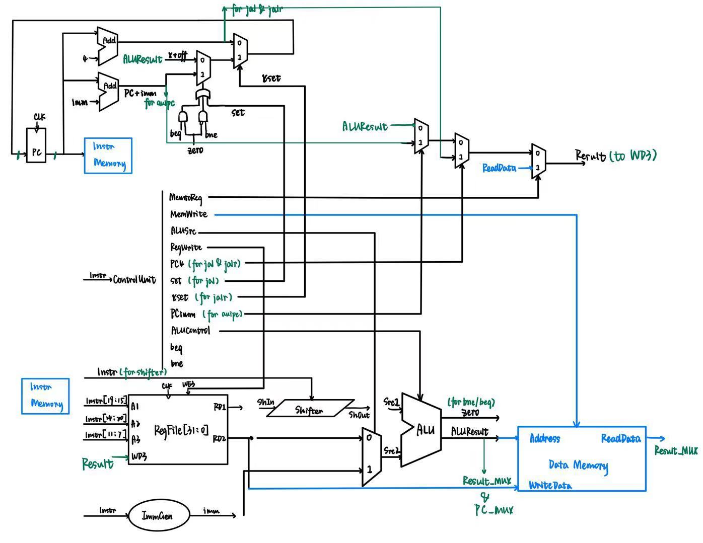
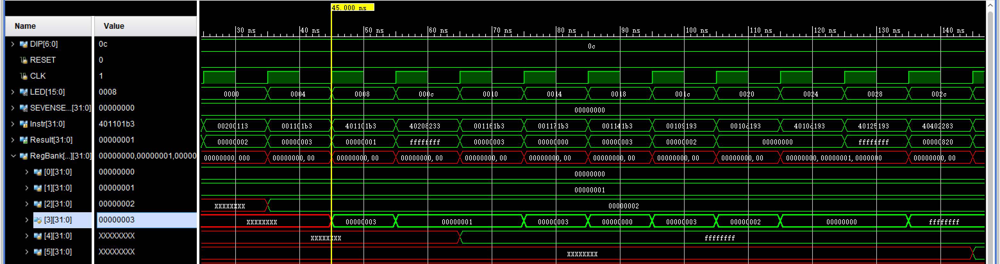
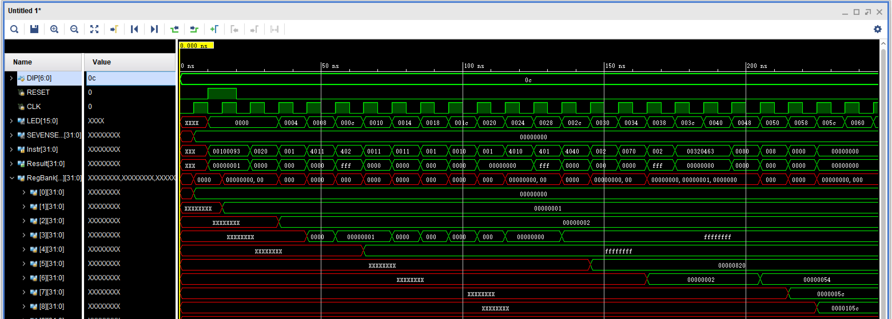

# 单周期 RISC-V CPU 的设计与实现

## 项目简介

本项目使用 **Verilog HDL** 设计并实现一个基于 **RV32I 指令集**的 **32-bit 单周期 RISC-V 处理器**。

项目从处理器整体数据通路出发，完成 **Program Counter、Control Unit、Register File、Immediate Data、Shifter、ALU、Data Memory 和 Result MUX** 等核心模块的设计，并针对 RISC-V 的指令格式和执行方式完成相应的控制逻辑与数据通路设计。

处理器支持算术、逻辑、移位、Load/Store、Branch 和 Jump 等多种类型指令，包括 `ADD`、`ADDI`、`SUB`、`AND`、`OR`、`XOR`、`SLLI`、`SRLI`、`SRAI`、`LW`、`SW`、`BEQ`、`BNE`、`JAL`、`JALR` 和 `AUIPC`。

最终通过 Verilog Testbench 和 RTL Simulation 对不同类型指令的数据通路、寄存器写回以及 PC 更新过程进行验证，并完成处理器整体系统集成。

---

## CPU 整体架构

下图展示了本项目实现的单周期 RISC-V CPU 整体数据通路，包括 Program Counter、Control Unit、Register File、Immediate Data、Shifter、ALU、Data Memory 以及 Result MUX 等主要模块。



---

## 主要任务

* **Program Counter**

  设计 RISC-V PC 更新与选择逻辑，在普通 `PC + 4` 顺序执行基础上，支持 Branch 和 Jump 指令产生的 `PC + Immediate` 与 `rs1 + Immediate` 等不同 PC 更新方式。

* **Control Unit**

  根据 RISC-V 指令中的 `opcode`、`funct3` 和 `funct7` 设计指令译码逻辑，为不同类型指令产生 Register Write、Memory Write、ALU Source、ALU Control、PC Selection 等控制信号。

* **Register File**

  实现 RV32I 的 **32 × 32-bit Register File**，支持双端口读取和单端口写入，并根据 RISC-V 规范保证 `x0` 寄存器始终保持为 `0`。

* **Immediate Data**

  针对 RISC-V 不同指令格式设计 Immediate Generator，实现不同位置立即数字段的提取、重新组合以及 Sign Extension。

* **Shifter**

  实现 RISC-V 移位指令的数据通路，支持 `SLLI`、`SRLI` 和 `SRAI`，并根据指令编码完成不同移位方式的选择。

* **Arithmetic Logic Unit**

  实现 `ADD`、`SUB`、`AND`、`OR` 和 `XOR` 等基础算术逻辑操作，同时产生 `zero` 判断结果，为 `BEQ / BNE` 等条件分支指令提供比较结果。

* **Memory & Write-Back**

  完成 Load / Store 数据通路，并扩展 Result MUX，使 Register File 的写回数据能够根据指令类型从 `ALUResult`、`ReadData`、`PC + 4` 和 `PC + Immediate` 等不同数据源中选择。

* **Processor Integration**

  完成各 RTL 模块之间的数据通路与控制信号连接，将指令读取、译码、寄存器访问、执行、访存、写回和 PC 更新集成为完整的单周期 RISC-V CPU。

---

## 支持的指令

| 指令类型            | 已实现指令                |
| --------------- | -------------------- |
| Arithmetic      | `ADD`、`ADDI`、`SUB`   |
| Logical         | `AND`、`OR`、`XOR`     |
| Shift           | `SLLI`、`SRLI`、`SRAI` |
| Load / Store    | `LW`、`SW`            |
| Branch          | `BEQ`、`BNE`          |
| Jump            | `JAL`、`JALR`         |
| Upper Immediate | `AUIPC`              |

---

## 遇到的问题与解决方法

### 1. RISC-V 不同指令需要不同的 PC 更新方式

**问题：**

普通指令执行完成后只需要进行 `PC + 4`，但 `BEQ / BNE / JAL / JALR` 等控制流指令会改变程序执行地址，因此单一的 PC 更新路径无法满足所有指令。

**解决：**

将 PC 更新和 PC MUX 分开设计，并根据指令类型和 Branch 判断结果选择不同的 PC Source：

* 普通指令：`PC + 4`
* Branch / JAL：`PC + Immediate`
* JALR：`rs1 + Immediate`

从而在统一的数据通路中支持顺序执行、条件跳转和无条件跳转。

---

### 2. RISC-V 指令类型较多，Control Unit 译码逻辑复杂

**问题：**

不同指令不仅需要根据 `opcode` 判断基本类型，部分指令还需要进一步结合 `funct3` 和 `funct7` 才能确定具体操作。

例如不同的 R-Type 和 Shift 指令可能具有相同的 `opcode`，无法仅通过一级译码直接确定 ALU 操作。

**解决：**

采用分层译码方式：

首先根据 `opcode` 判断 Arithmetic、Load/Store、Branch、Jump 等基本指令类型，再结合 `funct3 / funct7` 产生具体的 `ALUControl` 和其他控制信号。

通过对公共控制逻辑进行合并，减少重复译码逻辑。

---

### 3. 不同 RISC-V 指令的 Immediate 分布位置不同

**问题：**

RISC-V 的 I-Type、S-Type、B-Type、U-Type 和 J-Type 指令具有不同的立即数字段排列方式，并且 Branch / Jump Offset 还涉及不连续 Bit Field 的重新组合。

同时，立即数还需要正确处理正负数的 Sign Extension。

**解决：**

设计独立的 Immediate Data 模块，根据 `opcode` 判断当前指令类型，从 Instruction 中提取对应字段并重新组合，同时根据最高有效位完成 Sign Extension，最终生成统一的 32-bit Immediate。

---

### 4. Branch 指令需要同时完成运算和条件判断

**问题：**

`BEQ / BNE` 不仅需要计算新的 PC 地址，还需要比较 `rs1` 和 `rs2` 是否满足跳转条件。

如果额外增加独立比较器，会增加新的数据通路和硬件逻辑。

**解决：**

复用 ALU 的减法运算完成寄存器比较：

```text
rs1 - rs2 = 0
        ↓
      zero = 1
```

通过 `zero` 信号结合 `BEQ / BNE` 控制逻辑决定是否执行 Branch，从而复用已有 ALU 硬件资源完成条件判断。

---

### 5. Jump 指令增加了新的 Register Write-Back 数据来源

**问题：**

普通算术指令主要写回 `ALUResult`，`LW` 写回 `ReadData`，但 `JAL / JALR` 需要将 `PC + 4` 保存到目标寄存器，`AUIPC` 等指令也产生不同的数据来源。

因此原有简单 Write-Back 路径无法满足全部指令。

**解决：**

扩展 Result MUX，根据 Control Unit 输出的控制信号选择不同写回数据：

* `ALUResult`
* `ReadData`
* `PC + 4`
* `PC + Immediate`

从而在统一 Write-Back 数据通路下支持 Arithmetic、Load 和 Jump 等不同类型指令。

---

### 6. RISC-V Register File 要求 x0 始终保持为 0

**问题：**

RV32I 定义了 32 个通用寄存器，但 `x0` 是特殊寄存器，其读取结果必须始终为 `0`，不能被普通指令修改。

**解决：**

在 Register File 的写入逻辑中加入目标寄存器地址判断，仅当 Write Enable 有效且目标地址不为 `x0` 时执行写入，并保证 `RegBank[0]` 始终保持为 `32'b0`。

---

## 仿真与验证

为了验证处理器的数据通路和控制逻辑，本项目编写了一组 RISC-V Machine Code，对不同类型指令进行 RTL Simulation。

测试覆盖：

* Arithmetic Operations
* Logical Operations
* Shift Operations
* Load / Store
* Conditional Branch
* Jump / Link
* Register Write-Back
* Program Counter Update

通过观察 **Program Counter、Instruction、Register File、ALU Result、Data Memory 以及相关控制信号**的变化，确认不同类型指令能够按照预期的数据通路完成执行。





---

## 项目结果

* 完成 **32-bit RV32I 单周期 RISC-V CPU** RTL 设计
* 实现 **32 × 32-bit Register File**，并保证 `x0 = 0`
* 完成 RISC-V **Instruction Decoder / Control Unit**
* 实现不同 RISC-V 指令格式的 **Immediate Generation**
* 实现 `ADD / SUB / AND / OR / XOR` 等 ALU 运算
* 实现 `SLLI / SRLI / SRAI` 移位运算
* 实现 `LW / SW` Memory Access
* 实现 `BEQ / BNE` Conditional Branch
* 实现 `JAL / JALR` Jump and Link
* 实现 `AUIPC` 指令
* 完成 PC 多路径选择与 **Branch / Jump Control**
* 完成 ALU、Memory、PC 等多数据源 **Register Write-Back**
* 完成 Verilog Testbench 与 **RTL Simulation 功能验证**
* 完成单周期 RISC-V CPU 整体数据通路与系统集成

---

## 完整项目报告

README 主要展示项目的核心设计、实现内容以及验证结果。

关于以下内容的详细说明：

* RISC-V 指令集介绍
* RISC-V 与 ARM 架构对比
* CPU 整体数据通路
* Program Counter 设计
* Control Unit 与指令译码
* Register File
* Immediate Data
* Shifter
* ALU
* Result MUX
* 各类型指令执行过程
* Testbench 与仿真波形分析
* 项目实现过程中的问题与总结

请参阅本仓库中的完整 **Project Report PDF**。
